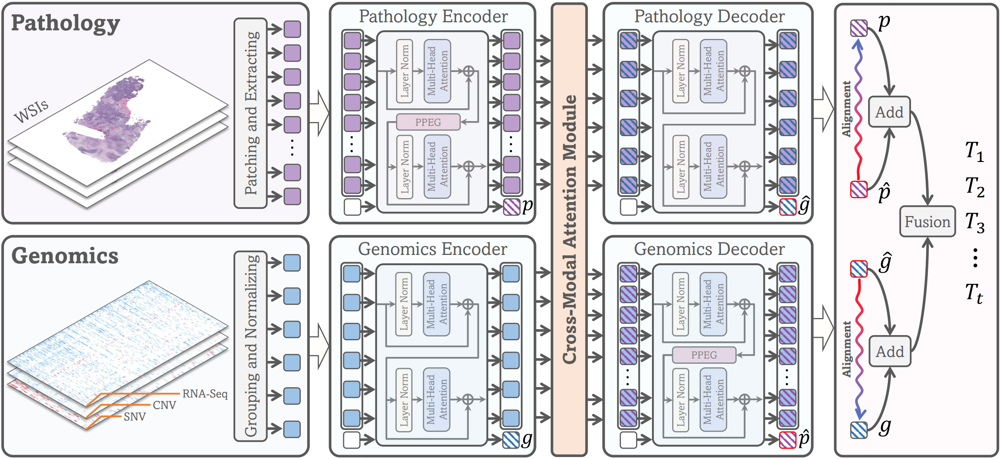

# CMTA
<details>
<summary>
  <b>Cross-Modal Translation and Alignment for Survival Analysis</b>, ICCV 2023.
  <a href="https://arxiv.org/pdf/2309.12855.pdf" target="blank">[arxiv]</a> <a href="https://openaccess.thecvf.com/content/ICCV2023/papers/Zhou_Cross-Modal_Translation_and_Alignment_for_Survival_Analysis_ICCV_2023_paper.pdf" target="blank">[link]</a>
  <br><em>Fengtao ZHOU, Hao CHEN</em></br>
</summary>

```bash
@inproceedings{zhou2023cross,
  title    ={Cross-Modal Translation and Alignment for Survival Analysis},
  author   ={Zhou, Fengtao and Chen, Hao},
  booktitle={Proceedings of the IEEE/CVF International Conference on Computer Vision},
  pages    ={21485--21494},
  year     ={2023}
}
```
</details>

**Summary:** Here is the official implementation of the paper "Cross-Modal Translation and Alignment for Survival Analysis".



### Pre-requisites:
```bash
torch 1.12.0+cu116
scikit-survival 0.19.0
```
### Prepare your data
#### WSIs
1. Download diagnostic WSIs from [TCGA](https://portal.gdc.cancer.gov/)
2. Use the WSI processing tool provided by [CLAM](https://github.com/mahmoodlab/CLAM) to extract resnet-50 pretrained 1024-dim feature for each 256 $\times$ 256 patch (20x), which we then save as `.pt` files for each WSI. So, we get one `pt_files` folder storing `.pt` files for all WSIs of one study.

The final structure of datasets should be as following:
```bash
DATA_ROOT_DIR/
    └──pt_files/
        ├── slide_1.pt
        ├── slide_2.pt
        └── ...
```

DATA_ROOT_DIR is the base directory of cancer type (e.g. the directory to TCGA_BLCA), which should be passed to the model with the argument `--data_root_dir` as shown in [run.sh](run.sh).

#### Genomics
In this work, we directly use the preprocessed genomic data provided by [MCAT](https://github.com/mahmoodlab/MCAT), stored in folder [csv](./csv).

## Training-Validation Splits
Splits for each cancer type are found in the `splits/5foldcv ` folder, which are randomly partitioned each dataset using 5-fold cross-validation. Each one contains splits_{k}.csv for k = 1 to 5. To compare with MCAT, we follow the same splits as that of MCAT.

## Running Experiments
To train CMTA, you can specify the argument in the bash `run.sh` and run the command:
```bash
bash run.sh
```
or use the following generic command-line and specify the arguments:
```bash
CUDA_VISIBLE_DEVICES=<DEVICE_ID> python main.py \
                                      --which_splits 5foldcv \
                                      --dataset <CANCER_TYPE> \
                                      --data_root_dir <DATA_ROOT_DIR>\
                                      --modal coattn \
                                      --model cmta \
                                      --num_epoch 30 \
                                      --batch_size 1 \
                                      --loss nll_surv_l1 \
                                      --lr 0.001 \
                                      --optimizer SGD \
                                      --scheduler None \
                                      --alpha 1.0
```
Commands for all experiments of CMTA can be found in the [run.sh](run.sh) file.

## Acknowledgements
Huge thanks to the authors of following open-source projects:
- [CLAM](https://github.com/mahmoodlab/CLAM)

## License & Citation 
If you find our work useful in your research, please consider citing our paper at:
```bash
@inproceedings{zhou2023cross,
  title    ={Cross-Modal Translation and Alignment for Survival Analysis},
  author   ={Zhou, Fengtao and Chen, Hao},
  booktitle={Proceedings of the IEEE/CVF International Conference on Computer Vision},
  pages    ={21485--21494},
  year     ={2023}
}
```
This code is available for non-commercial academic purposes. If you have any question, feel free to email [Fengtao ZHOU](fzhouaf@connect.ust.hk).